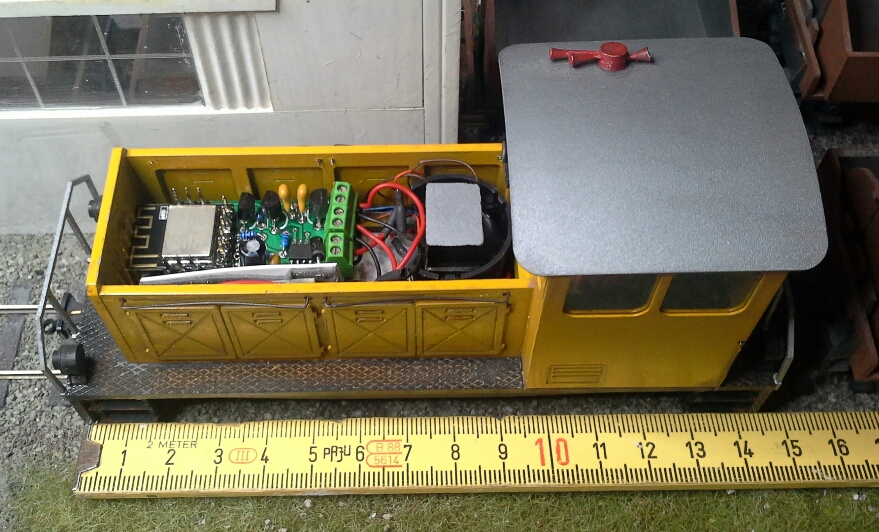

# DCC Generator mit Hilfe einer DRV8870-Platine

Dieses Dokument beschreibt den [DCC Generators](index.md) auf Basis einer selbst entwickelten Platine mit einem DRV8870 und einem ESP-M3 (aus der ESP8266-Serie).

## Schaltplan / Aufbau

Auf der Platine werden als Hauptkomponenten ein ESP-M3 und ein DRV8870 gelötet.

Die Platine ist inkl. ESP-M3  4,3 x 2,2 cm groß.

## Ansteuerung

Die Lösung kann über 2 Wege gesteuert werden:

* Der Decoder kann sich über WLAN mit einer Z21 verbinden und von dort die Befehle erhalten.
* Der Decoder kann eine Z21 simulieren und ein WLAN-Netz aufspannen.
   Anschließend kann man den Decoder direkt und ohne die Notwendigkeit einer Z21 ansteuern. Die Z21-App oder die WLAN-Maus kann zur Steuerung genutzt werden.

## Nutzungsbeispeile

Hier beispielhaft in einer Spur 0 Lok verbaut. Als Decoder wird ein ESU LokSound 4 genutzt. 

*Copyright by Ralf Stassrast*

## Technischer Hintergrund

siehe [DCC Generator](index.md)