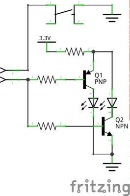

# Gleisstellwerk
Motiviert durch eine Anfrage von Nobert, habe ich alle Funktionalität eingebaut, die man für ein kabelloses Gleisstellwerk benötigt. 
Kabellos meint in diesem Zusammenhang, dass alle Weichen-Befehle per Wlan übertragen werden. Es wird somit nur Strom benötigt, welches aber auch per Akku zur Verfügung gestellt werden kann.

Aktuell funktioniert der Gleisstellwerk Prototyp "nur" mit einer z21, eine Nutzung von Rocrail sollte mit vertretbaren Aufwand möglich sein.

## Aktueller Entwicklungsstand
Prototypische Implementierung für eine Weiche. 

[Video](http://www.open4me.de/my-content/prototype_element_gleisstellwerk.mp4)

1. Mit dem Taster kann der Zustand der Weiche geändert werden
Wenn der Taster gedrückt wird, wird der Befehl zum Weichenstellen an die Z21 gesendet.

2. Die LEDS reagieren auf die Rückmeldung der z21.
Wenn die Z21 einen Befehl zum Weichenstellen erhält, meldet die z21 die Änderung an den ESP8266 und die LEDs ändern sich entsprechend.
Die LEDs zeigen somit immer den Zustand der z21 an.
 
## Hardware
Hauptkomponenten sind ein ESP8266 (z.B. D1 mini)
 

Um eine Weiche zu steuern, werden ein NPN-Transistor (z.B. 2N2222A), ein PNP-Transistor (z.B. BC327-40), zwei LEDS, ein Taster und drei Wiederstände (220 OHm) benötigt. 
Da der D1 mini nicht genügend IO-Pin hat, werden Port-Erweiterungen vom Typ MCP23017 genötigt. Ein MCP23017 kann dann jeweils 8 Weichen ansteuern. 
