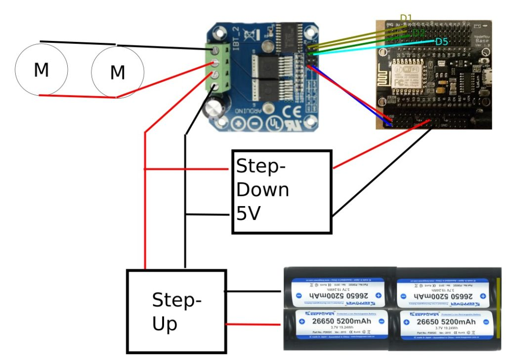

# Lokdekoder (BTS7960)

Für diesen Lokdekoder wird eine fertige [H-Bridge](/Erklärungen/H-Bridge.md) vom Typ BTS7960 genutzt. Diese H-Bridge ist ausreichend, um z.B. eine Piko-Lok mit zwei Motoren anzutreiben.

## Ansteuerung

Die Lösung kann über 2 Wege gesteuert werden:

* Der Decoder kann sich über WLAN mit einer Z21 verbinden und von dort die Befehle erhalten.
* Der Decoder kann eine Z21 simulieren und ein WLAN-Netz aufspannen.
   Anschließend kann man den Decoder direkt und ohne die Notwendigkeit einer Z21 ansteuern. Die Z21-App oder die WLAN-Maus kann zur Steuerung genutzt werden.

## Schlatplan / Aufbau

 
## Technischer Hintergrund
Ich habe den Aufbau über einen Step-Up Regler (Ausgang: ~17V) gewählt, damit ich auch andere Akkupacks anschließen kann, die niedrige Spannungen liefern. Testweise habe ich es mit einer 5V USB Powerbank getestet. Hierbei überhitzt der ausgewählte  Step-Up-Regler. Sollte jemand den 5V Weg gehen wollen, könnte man Kühlköper probieren. Ich vermute aber, dass man einen anderen Step-Up-Regler auswählen müsste.
Je nach Spannung des Akku kann der Step-Up Regler aber auch ersatzlos entfallen. 

Bei den Akkus habe ich mich bewusst für geschützte Akkus entschieden und kann dadurch eine zusätzliche Schutz- und Entladeschaltung verzichten. Da das Thema Fälschung von Akkus ein ziemliches Problem darstellt, sollte man bei vertrauenswürdigen Lieferanten kaufen. 
