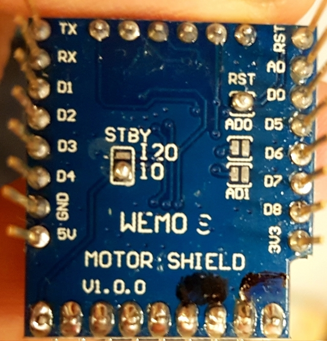

# Lokdekoder (D1-Mini und Shield)

Für die Lösung wird ein D1-Mini und ein D1-Motor-Shield ([Version 1](https://wiki.wemos.cc/products:retired:motor_shield_v1.0.0)) genutzt.

Das Shield kommuniziert über I2C, kann zwei Motoren bis 1,2 A (Peak 3,2 A) ansteuern und ist somit für kleinere Loks geeignet.


## D1-Motor-Shield
Leider enthält die Shield-Firmware im Originalzustand einen Bug. Wenn 10 Sekunden lang keine I²C Befehl kommt, friert das Board ein.

Aus diesem Grund muss die Firmware aktualisiert werden. Auf [Hackaday](https://hackaday.io/project/18439-motor-shield-reprogramming/log/57855-reprogramming-without-soldering)
ist eine Anleitung zum Update zu finden. Eine fertig kompilierte und getestete Firmware kann im
[open4me-Forum](https://forum.open4me.de/viewtopic.php?f=4&t=69&start=40#p591) gefunden werden.

Die I2C Adresse sowie einige andere Features können mit Lötpads auf der Unterseite eingestellt werden. Da bei den verschiedenen Auslieferungen die Lötpad-Konfigurationen verschieden sind, ist es notwendig, dass das Board kontrolliert und wenn nötig, folgendermaßen konfiguriert ist:


- Die Lötpads RST muss verbunden werden
- Von den drei Lötpads STBY müssen die beiden für I2C verbunden werden
- RST padden und STBY auf I2C (um)padden.
- Für die Standard-Adresse 48, müssen AD0 und AD1 offen sein

| AD1 | AD0 | Adresse (HEX)  | Adresse (DEC) |
| -------- | -------- | -------- | ---- |
| offen   | offen   | 0x30  | 48 |
| offen   | geschlossen   | 0x2F  | 47 |
| geschlossen | offen | 0x2E | 46 |
| geschlossen | geschlossen | 0x2D | 45 |




## Konfiguration


Der Configfile-Generator unterstützt das D1-Mni-Shield noch nicht.


```
{
    "version":"3",
    "cfg":[
        {
            "m":"ap",
            "ssid":"SSID",
            "kanal":"6",
            "pwd":"XXXXXXXX"
        },
        {
            "m":"webservicewifiscanner"
        },
        {
            "m":"webservicelog"
        },
        {
            "m":"cmdlogger"
        },
        {
            "m":"i2c",
            "sda":"D2",
            "scl":"D1"
        }
    ],
    "out":
        [
        {
	    "id":"pwm1",
            "m":"pwm",
            "type":"shieldv1",
            "i2caddr", "48",
            "motoridx", "0"
        }
    ],
    "in":
       [
       {
            "m":"locospeed",
            "addr":4711,
            "out":[
                "pwm1"
            ]
        }
    ],
    "connector":[
    ]
}

```
