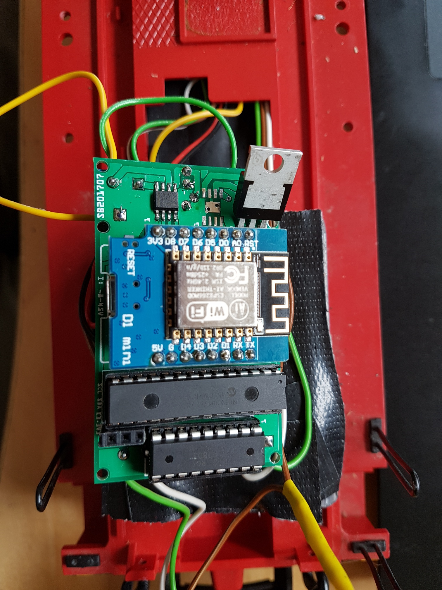

# Lokdekoder (DRV8870)

Dieser Dekoder ist wahlweise mit einer oder zwei [H-Bridge](/Erklärungen/H-Bridge.md) vom Typ [DRV8870](http://www.ti.com/product/DRV8870) ausgestattet und sollte somit auch für Piko-Loks mit zwei Motoren geeignet sein.

[Weitere Informationen](http://gartenbahn-45-mm.phpbb8.de/allgemein-f29/lok-akku-und-wlan-nahtlose-z21-integration-t8336-15.html#p105953)

## Funktionsumfang

* 2x DRV8870 mit je max 2A
* 8x unverstärkte Ausgänge
* 8x verstärkte Ausgänge

## Ansteuerung

Die Lösung kann über 2 Wege gesteuert werden:

* Der Decoder kann sich über WLAN mit einer Z21 verbinden und von dort die Befehle erhalten.
* Der Decoder kann eine Z21 simulieren und ein WLAN-Netz aufspannen.
   Anschließend kann man den Decoder direkt und ohne die Notwendigkeit einer Z21 ansteuern. Die Z21-App oder die WLAN-Maus kann zur Steuerung genutzt werden.

## Schlatplan / Aufbau
 
## Technischer Hintergrund

Um die Anzahl der Ausgänge zu erhöhen, wird ein Port-Expander (MCP23017) genutzt der via i²C an den ESP8266 angeschlossen ist. 8 Ausgänge des MCP23017 steuern einen ULN2803A an. Somit stehen 8 "unverstärkte" und 8 "verstärkte" Ausgänge zur Verfügung.
