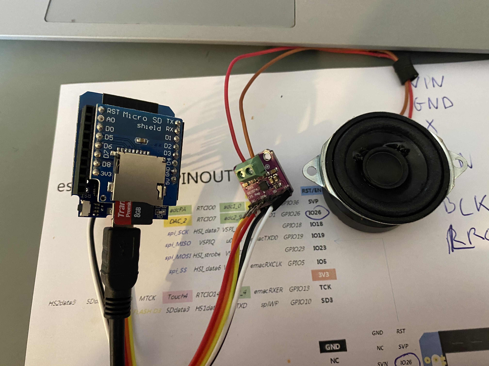
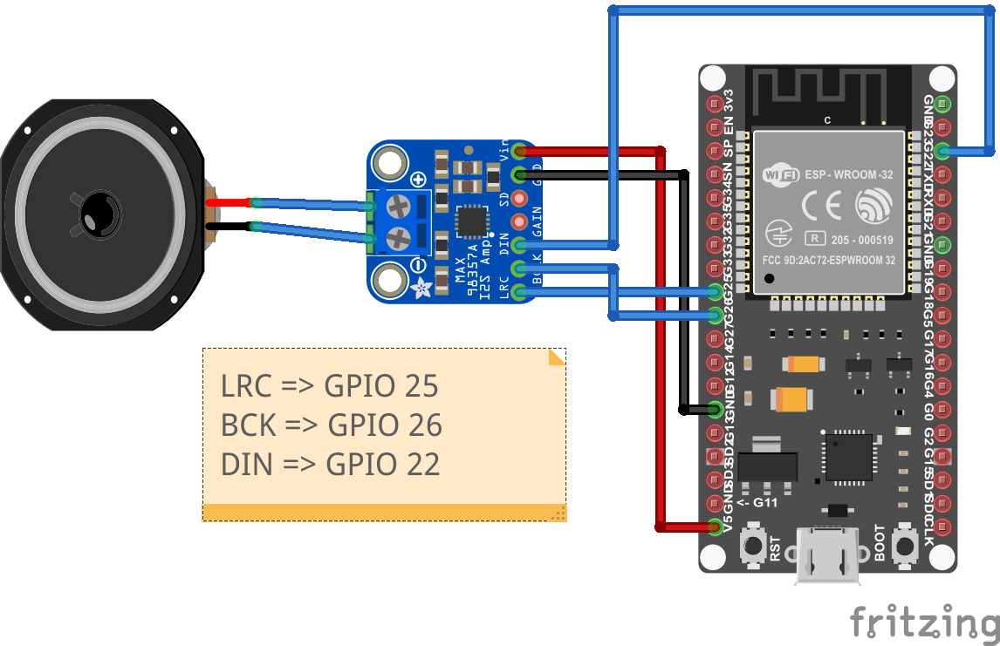

# Sound

Sounddateien können mit Hilfe eines esp32, einem I2S-Soundboard und einem einfachen Lautsprecher abgespielt werden.

[Video](https://www.open4me.de/my-content/ESP32_MAX98357A.mp4)

 

Einzelne Sounddateien können z.B. über F-Tasten oder durch die Betätigung von Taster, die an dem esp32 angeschlossen sind, abgespielt werden.

## Sounddateien
Die Sounddateien müssen nummeriert auf der SD-Karte (FAT32 formatiert) oder im internen Flash-Speicher (max 1,3 MB aktuell) abgelegt werden. Der Dateityp kann für jede Datei variieren. Unterstützt werden MP3 und WAV Dateien. Sie müssen nicht durchnummiert sein. Für jede F-Taste oder Taster kann festgelegt werden, welche Nummer gespielt werden soll.
 
- 1.mp3
- 2.wav
- 3.mp3
- 10.wav

Bei MP3 sollten alle [id3-Tags](https://de.wikipedia.org/wiki/ID3-Tag) entfernt werden, da es ansonsten zu einem verzögerten Abspielen kommen kann. 

## Einschränkungen
Die Implementierung ist nicht dafür geeignet, Loksound zu simulieren. Es wird immer eine einzelne Datei abgespielt. Ein Befehl eine neue Datei abzuspielen führt dazu, dass das Abspielen der aktuellen Datei abgebrochen wird und das Abspielen der neuen Datei begonnen wird. 

## Hardware
Hauptkomponenten sind ein ESP32 und einen I2SS-Soundboard.
Zum Einsatz kommt ein Soundboard mit 3 Watt Verstärker (Max98357).
 

