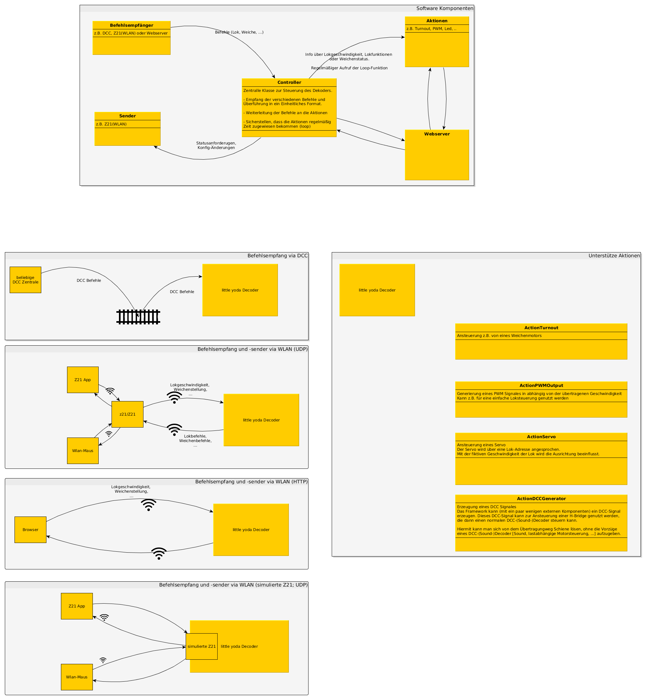
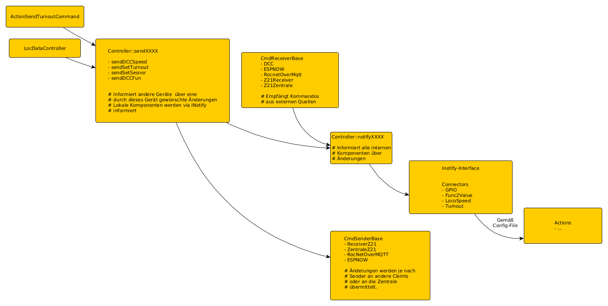

## Framework

Den Aufbau des Framework verdeutlich diese Grafik:

Die einzelnen Komponenten werden durch Klassen repräsentiert. Die Nutzung von Klassen erlaubt die relativ einfache Erweiterung des Frameworks.

## interne Bearbeitung von Kommandos
Intern werden die Kommandos/Änderungen (Geschwindigkeit, F-Status, ...)
folgendermaßen verarbeitet:

