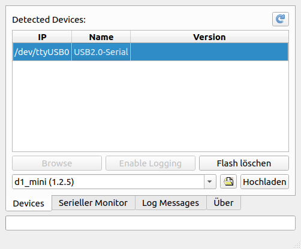
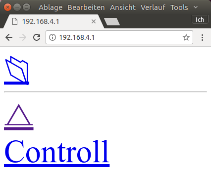

# Erste Schritte

Die Seite soll euch bei den ersten Schritten unterstützen.

# Hardware
Für die ersten Schritte, benötigt ihr eine ESP8266-Platine und ein passenden USB-Kabel.

Ich empfehle entweder den [Nodemcu V2(*)](http://s.click.aliexpress.com/e/rnqr7AI) oder den [D1 Mini(*)](http://s.click.aliexpress.com/e/nuzRzJ2), die für wenige Euros in Asien bestellt werden können. Je nach Verwendungszweck sind die [Platinen](Platinen) mal auf den Nodemcu und mal auf den D1 Mini oder auf ein anderes Modell auslegt.

# Programm übertragen
Um den ESP nutzen zu können, muss als erstes die Firmware auf den ESP geflasht werden.

Um diesen Vorgang möglichst einfach zu halten, existiert der [LittleYoda Flasher](https://github.com/littleyoda/littleyoda-DCC-Decoder-Flasher/releases/latest) für Windows und Linux.

Das ESP8266-Board (ohne weitere Platinen oder ähnliches) wird direkt an den Rechner angeschlossen und anschließend der LittleYoda-Flasher gestartet.

Zum Flashen wird nun der erkannte ESP ausgewählt (z.B. /dev/ttyUSB0 unter Linux oder COM9 unter Windows) werden.

Unten links muss eine für das Board passende Firmware (D1 Mini, Nodemcu V2, ...) ausgewählt werden. Für jedes Board existieren üblicherweise zwei Versionen. Eine Release-Version ("1.x.x") und eine Entwickler-Version ("Alpha/Beta"). Ohne guten Grund sollte die Release-Version genutzt werden, da diese in der Regel stabiler als die Entwickler-Version ist.

Das Flashen kann anschließend über den Befehl "Hochladen" gestartet werden.

Nach dem ersten erfolgreichen Flashen sollte ca. 30 Sekunden gewartet werden, da in dieser Zeit der ESP seinen eingebauten Flash-Speicher formatiert.

# Erste Kontaktaufnahme
Die erste Kontaktaufnahme erfolgt über WLAN. Nachdem der ESP8266 fertig ist und ggf. einmal neu gestartet wurde (USB-Kabel raus/rein), sollte er ein eigenes WLAN mit dem Namen "HALLO WORLD" aufspannen. Verbindet euch bitte mit diesem WLAN und gebt in einem Browser die folgende Adresse ein "192.168.4.1". Danach solltet ihr eine Webseite der folgenden Art sehen:

Anschließend müssen die Dateien css.css und milligram.min.css hochgeladen werden.
Hierzu muss das Ordnersymbol angeklickt werden:

Anschließend für beide Dateien jeweils einmal auf "Datei auswählen" klicken, die entsprechende Datei auswählen und auf "Send" klicken.

Die Hauptseite "192.168.4.1" sollte anschließend so aussehen:

# Konfigurieren
In diesem Zustand kann der ESP8266 noch nicht viel. Als nächstes muss die Konfigurations-Datei hochgeladen werden. Die Konfiguration ist von dem [Einsatzzweck](Platine) abhängig. 
Mit Hilfe des [Config-Generators](https://spurg.open4me.de/configgenerator) kann die passende Konfiguration erstellt werden. Unter dem Punkt "Voreinstellungen" können diverse Konfigurationen für die Standard-Anwendungen ausgewählt werden.
Die Konfiguration muss als config.json gespeichert werden.

# Kontaktaufnahme über die serielle Schnittstelle
Bei Problemen mit dem ESP ist ggf. ein Zugriff über die serielle Schnittstelle notwendig.

Hierzu kann der LittleYoda Flasher genutzt werden. Wie beim Flashen wird der ESP wieder über ein USB-Kabel mit dem Computer verbunden. Der passende Gerät wird in dem "Devices"-Tab ausgewählt und anschließend kann über dem Befehl "Verbinden" im "Serieller Monitor"-Tab die Verbindung aufgebaut werden.

Durch die Angabe des Befehl "debug" in dem Textfeld, kann der ESP in den Debug-Modus geschaltet werden. 
